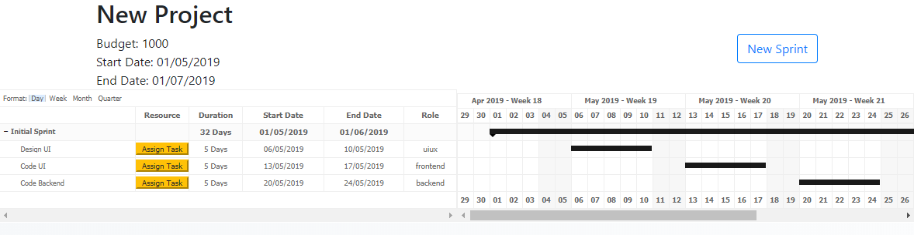

# IS4100 iSprint

This is a project for [IS4100](https://nusmods.com/modules/is4100/it-project-management).

iSprint is a resource allocation tool for managing human resource in an agile development environment. It assigns tasks to members in an agile team by taking in consideration of members' personal schedules. This tool is meant to be used by project managers.

**Live demo:** https://is4100-isprint.herokuapp.com

If you are having trouble reading this readme file, go to the github repo at https://github.com/hidingmode/IS4100-iSprint

## Getting Started

These instructions will get you a copy of the project up and running on your local machine.

### Prerequisites

All you need is [Node.js v11.13.0 or above](https://nodejs.org/en/download/current/)

### Installing

To install the project, go to the project directory, open terminal and enter 

```
npm install
```
Once the command finishes running, you should see a folder named `node_modules` generated in the project directory.

### Running

To run the project, enter

```
npm start
```

You should see the message
```
express server running on port 8080
```

The project runs by default on http://localhost:8080.

## Demo

As this project is a prototype, we have set up several google accounts to represent an agile team for demo purposes. **The project will only work with these google accounts.**

| Members | Emails                        | Role               | Busy Dates on May |
|---------|-------------------------------|--------------------|-------------------|
| Patrick | patrick.iSprintDemo@gmail.com | Project Manager    |                   |
| Alex    | alex.iSprintDemo@gmail.com    | UI/UX              | 7, 8              |
| Bob     | bob.iSprintDemo@gmail.com     | UI/UX              |                   |
| Charlie | charlie.iSprintDemo@gmail.com | Frontend Developer | 13, 15, 17        |
| Dex     | dex.iSprintDemo@gmail.com     | Frontend Developer |                   |
| Eddy    | eddy.iSprintDemo@gmail.com    | Backend Developer  | 21, 22            |
| Fara    | fara.iSprintDemo@gmail.com    | Backend Developer  |                   |

The passwords for all the demo gmail accounts are `isprint4100`

Each member has their own google calendars and for the sake of demo, one member of each role is busy on certain dates while the other is free. It is best if you can login to all the accounts and have a look at their google calendars while using the project. Feel free to add/modify/remove events on their calendars for testing.

### Usage

1. Go to the http://localhost:8080
   - This will redirect to the Google OAuth sign in page
2. Sign in as `patrick.isprintdemo@gmail.com` with password `isprint4100`
   - Click allow when prompted to give access
   - This will redirect to the home page
   - The home page lists shows all the projects with gantt charts on each project's sprints and tasks
   
   

3. Create a project by hovering on the Projects tab in the navigation bar

   
   
   - Fill up the form with project details and submit
     - Name: New Project
     - Date: 01/05/2019 - 01/07/2019
     - Description: Cool new project
     - Budget: 1000
   - This will redirect to the home page
   - The newly created project will show up at the bottom
   
   

4. Create a sprint for the new project
   - Click on the New Sprint button to the left
   - Fill up the form with sprint details
     - Name: Initial Sprint
     - Date: 01/05/2019 - 01/06/2019
     - Description: Awesome sprint
     - Budget: 200
   - Add sprint tasks for the new sprint
     1. Sprint task 1
        - Name: Design UI
        - Description: Make it beautiful
        - Date: 06/05/2019 - 10/05/2019
        - Role: UI/UX
     2. Sprint task 2
        - Name: Code UI
        - Description: Make it cool
        - Date: 13/05/2019 - 17/05/2019
        - Role: Frontend Developer
     3. Sprint task 3
        - Name: Code Backend
        - Description: Make it robust
        - Date: 20/05/2019 - 24/05/2019
        - Role: Backend Developer
   - Submit the form by clicking on Create new Sprint
   - This will redirect to the home page

   

5. Assign members to each task
   - Click on the Assign Task button for Design UI
   - The dropdown only shows members who has the role suited for the task
   - One member is greyed out because he is busy on dates overlapping with the task date range
   - Select the available member and click Assign Task
   
   

   - This will create an event in the calendar of the selected member with the task details

   
   
   - Repeat for the other tasks

## Built With

* [Express.js](https://expressjs.com) - Node.js web framework
* [Google API node client](https://github.com/googleapis/google-api-nodejs-client) - Library for accessing Google services
  * [Google Calendar API](https://developers.google.com/calendar/) - Access to members' calendars and creation of task events
* [Firebase Firestore](https://firebase.google.com/products/firestore/) - NoSQL database

## The Team

* Ashley Loh Wee Siong
* [Calvin Yee Zixiang](https://github.com/Calyeefornia)
* Chan Shi Qi Athena
* [David Choo](https://github.com/hidingmode)
* [Glenn Yeo Gen Yew](https://github.com/glennygy)

## License

This project is licensed under the MIT License - see the [LICENSE.md](LICENSE.md) file for details
